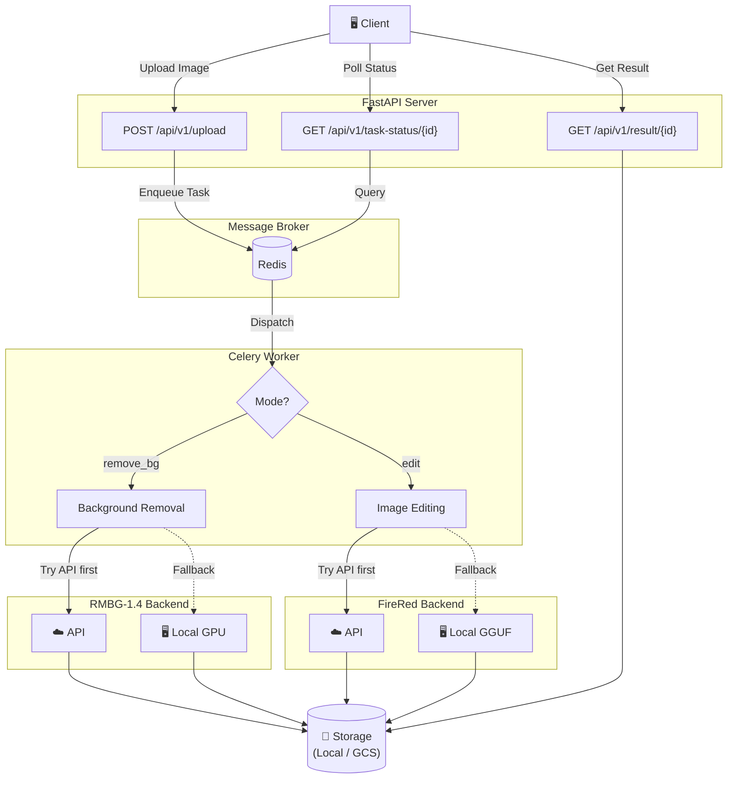

# Ecommerce Visual Pro

AI-powered e-commerce product photo optimization microservice.

## Features

- **Flexible Compute Architecture** — Support for zero-cost local GPU inference during development, with seamless switching to cloud APIs for high-concurrency production environments.
- **Background Removal** — Integrates RMBG-1.4. Uses highly efficient API generation by default, while providing a lightning-fast local GPU fallback for development or on-premise servers.
- **Instruction-based Image Editing** — Integrates FireRed-Image-Edit-1.1. Uses highly efficient API generation by default, while providing a local GGUF model deployment option for development or on-premise servers.
- **Async Processing** — Robust background task queue built with Celery + Redis to perfectly isolate long-running AI tasks.
- **Storage** — Local filesystem storage with a modular interface ready for seamless migration to cloud storage (e.g., GCS).

## Architecture



## Requirements

- Python 3.12+
- NVIDIA GPU with CUDA
  - **16GB+ VRAM** required for default local inference (e.g. RTX 4080, RTX 3090/4090). loading T5-XXL + FireRed Transformer + VAE takes ~15-17GB.
  - **⚠️ Warning for 8GB~12GB VRAM:** Running the default `diffusers` code on GPUs like RTX 4070 (12GB) or RTX 2070 (8GB) will cause severe memory swapping (Shared GPU Memory) making generation take over 1-2 hours per image. For these GPUs, it is highly recommended to use the **API fallback**, integrate `bitsandbytes` (8-bit T5), or use **ComfyUI/Forge**.
- Redis (for task queue)

## Quick Start

```bash
# Install dependencies
uv sync

# Run development server
uv run uvicorn app.main:app --reload

# Run Celery worker (requires Redis)
uv run celery -A app.core.celery_app worker --loglevel=info
```

## Processing Modes

### Mode: `remove_bg` — Background Removal Only

Removes the background from a product image using RMBG-1.4, producing a transparent PNG.

```bash
curl -X POST http://localhost:8000/api/v1/upload \
  -F "file=@product.jpg" \
  -F "mode=remove_bg"
```

### Mode: `edit` — Instruction-based Image Editing

Uses FireRed-Image-Edit-1.1 to edit the image based on a natural language instruction.

```bash
curl -X POST http://localhost:8000/api/v1/upload \
  -F "file=@product.jpg" \
  -F "mode=edit" \
  -F "instruction=Place this product on a sleek marble table with warm studio lighting, professional product photography"
```

## Example Instructions

Here are some effective instructions for the `instruction` parameter:

### Minimal & Clean (Best for Tech/Gadgets)

- `Place this product on a clean white studio background with soft studio lighting, professional product photography, sharp focus, photorealistic`
- `Place this product on a sleek black marble podium with dark studio styling, dramatic rim lighting, premium aesthetic`

### Lifestyle & Contextual (Best for Fashion/Home)

- `Place this product on a cozy wooden table with a blurred bright cafe background in the morning, soft warm sunlight filtering through a window`
- `Place this product on a natural stone block surrounded by subtle green palm shadows, bright airy bathroom setting, spa atmosphere`

### Creative & Vibrant (Best for Cosmetics/Beverages)

- `Place this product in crystal clear splashing water with bright summer lighting, turquoise background, high speed photography, refreshing vibe`
- `Surround this product with floating pastel geometric shapes, vibrant studio lighting, pop art style, clean colorful background`

### Urban & Streetwear (Best for Sneakers/Footwear)

- `Place this product on rough urban concrete with dramatic neon street lighting at night, puddle reflections, gritty and stylish footwear photography`
- `Suspend this product in mid-air against a sleek metallic studio surface, dynamic angle, high-energy directional lighting, premium athletic vibe`

## API Endpoints

| Method | Endpoint | Description |
|--------|----------|-------------|
| GET | `/health` | Health check |
| POST | `/api/v1/upload` | Upload image for processing |
| GET | `/api/v1/task-status/{id}` | Get task status |
| GET | `/api/v1/result/{id}` | Get processing result |

## Project Structure

```text
app/
├── api/routes.py       # FastAPI endpoints
├── core/
│   ├── auth.py         # Authentication & Rate limiting
│   ├── config.py       # Settings (pydantic-settings)
│   └── celery_app.py   # Celery configuration
├── schemas/task.py     # Pydantic models
├── services/
│   ├── ai_service.py   # AI model integrations
│   └── storage.py      # Storage service
└── tasks/              # Celery tasks
tests/                  # pytest test suite
```

## Configuration

Create `.env` file:

```env
# Storage
STORAGE_TYPE=local
LOCAL_STORAGE_PATH=./storage

# Redis
REDIS_URL=redis://localhost:6379/0

# AI APIs (optional, local model fallback used if API is unavailable/not configured)
RMBG_API_URL=
RMBG_API_KEY=
FIRERED_API_URL=
FIRERED_API_KEY=
# Path to local GGUF model file (used when API is unavailable)
FIRERED_MODEL_PATH=
```

## Development

```bash
# Run tests
uv run pytest -v

# Lint
uv run ruff check .

# Type check
uv run mypy .
```

## License

MIT
