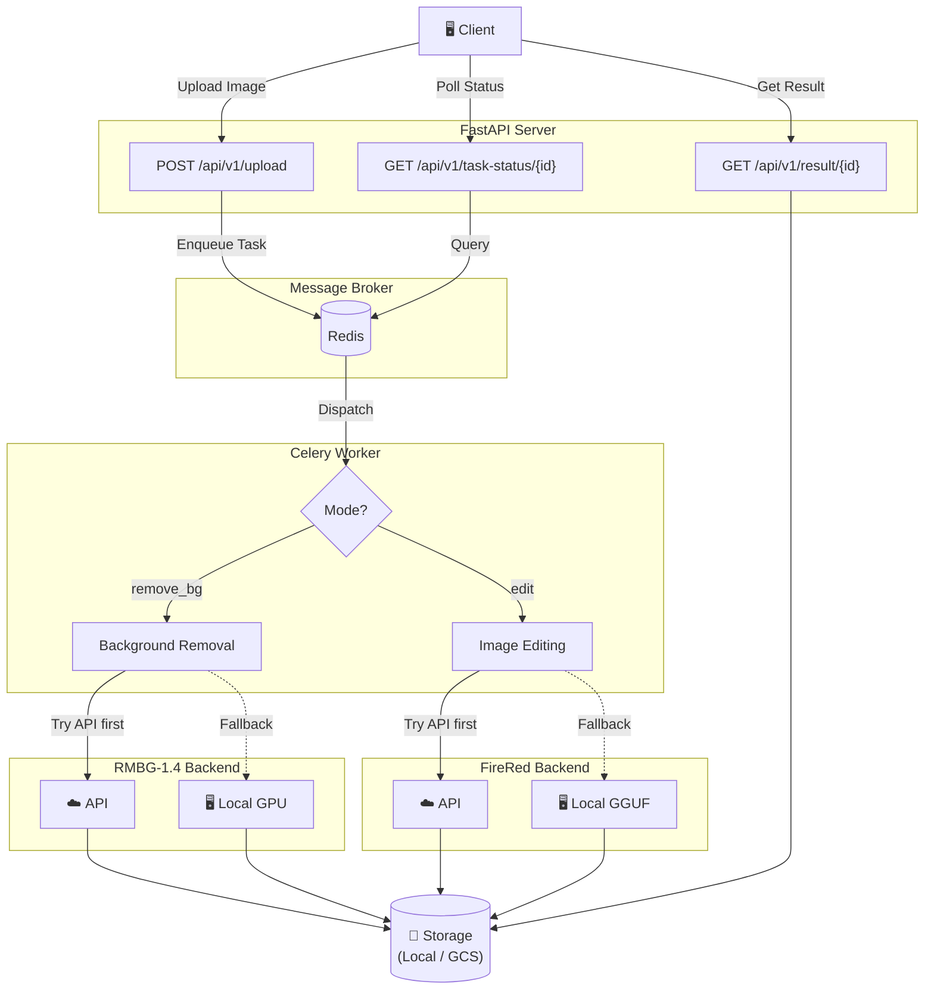

# Ecommerce Visual Pro

AI-powered e-commerce product photo optimization microservice.
Upload a product photo → get a professionally edited result in seconds.

## ✨ What It Does

### Background Removal

Automatically removes the background from a product image, producing a transparent PNG.

| Original | Result |
| :---: | :---: |
|  |  |

### Instruction-based Image Editing

Describe a scene in natural language and the AI places your product in it.

| Original | Result |
| :---: | :---: |
|  |  |

---

## 🚀 Quick Start

### Prerequisites

- Python 3.12+
- Redis (for task queue)
- NVIDIA GPU with CUDA *(optional — only needed for local AI inference, see [Compute Modes](#-flexible-compute) below)*

### 1. Install & Run

```bash
# Install dependencies
uv sync

# Start the API server
uv run uvicorn app.main:app --reload

# Start the Celery worker (in a separate terminal)
# On Linux/macOS (Cloud/Production):
uv run celery -A app.core.celery_app worker --loglevel=info

# On Windows (Local Demo):
uv run celery -A app.core.celery_app worker --pool=solo --loglevel=info
```

### 2. Try It

**Remove background:**

```bash
curl -X POST http://localhost:8000/api/v1/upload \
  -F "file=@product.jpg" \
  -F "mode=remove_bg"
```

**Edit with an instruction:**

```bash
curl -X POST http://localhost:8000/api/v1/upload \
  -F "file=@product.jpg" \
  -F "mode=edit" \
  -F "instruction=Place this product on a sleek marble table with warm studio lighting, professional product photography"
```

### 3. Get the Result

```bash
# Poll task status
curl http://localhost:8000/api/v1/task-status/{task_id}

# Download result when completed
curl http://localhost:8000/api/v1/result/{task_id}
```

---

## 💡 Prompt Cookbook

Effective `instruction` examples for the `edit` mode:

| Category | Example Instruction |
|---|---|
| **Minimal & Clean** (Tech/Gadgets) | `Place this product on a clean white studio background with soft studio lighting, professional product photography, sharp focus, photorealistic` |
| **Dark & Premium** (Tech/Gadgets) | `Place this product on a sleek black marble podium with dark studio styling, dramatic rim lighting, premium aesthetic` |
| **Lifestyle** (Fashion/Home) | `Place this product on a cozy wooden table with a blurred bright cafe background in the morning, soft warm sunlight filtering through a window` |
| **Spa & Natural** (Beauty/Home) | `Place this product on a natural stone block surrounded by subtle green palm shadows, bright airy bathroom setting, spa atmosphere` |
| **Refreshing** (Cosmetics/Beverages) | `Place this product in crystal clear splashing water with bright summer lighting, turquoise background, high speed photography, refreshing vibe` |
| **Pop Art** (Cosmetics/Beverages) | `Surround this product with floating pastel geometric shapes, vibrant studio lighting, pop art style, clean colorful background` |
| **Street** (Sneakers/Footwear) | `Place this product on rough urban concrete with dramatic neon street lighting at night, puddle reflections, gritty and stylish footwear photography` |
| **Athletic** (Sneakers/Footwear) | `Suspend this product in mid-air against a sleek metallic studio surface, dynamic angle, high-energy directional lighting, premium athletic vibe` |

---

## 🏗️ Architecture



### 🔌 Flexible Compute

Both AI services follow an **API-first, local-fallback** strategy — configure via environment variables:

| Service | API Mode (Default) | Local Fallback |
|---|---|---|
| **Background Removal** | Cloud API (fast, scalable) | RMBG-1.4 on local GPU |
| **Image Editing** | Cloud API (fast, scalable) | FireRed-Image-Edit-1.1 GGUF on local GPU |

> **💡 Tip:** Use **API mode** for production. Use **local mode** for free development/debugging without API costs.

> **⚠️ Local GPU Note:** FireRed local inference requires **16GB+ VRAM** (RTX 4080/3090/4090). On 12GB cards (RTX 4070), expect severe memory swapping and 1-2 hour generation times. For these GPUs, use the API fallback.

### Key Features

- **Flexible Compute Architecture** — Zero-cost local GPU inference for development, cloud APIs for production.
- **Background Removal** — RMBG-1.4 with API-first, local GPU fallback.
- **Instruction-based Image Editing** — FireRed-Image-Edit-1.1 with API-first, local GGUF fallback.
- **Async Processing** — Celery + Redis task queue isolates long-running AI tasks.
- **Storage** — Local filesystem with a modular interface for GCS migration.
- **Auth & Rate Limiting** — API Key, JWT, and configurable rate limiting (feature-flagged).

---

## 📖 Reference

### API Endpoints

| Method | Endpoint | Description |
|--------|----------|-------------|
| GET | `/health` | Health check |
| POST | `/api/v1/upload` | Upload image for processing |
| GET | `/api/v1/task-status/{id}` | Get task status |
| GET | `/api/v1/result/{id}` | Get processing result |

### Project Structure

```text
app/
├── api/routes.py       # FastAPI endpoints
├── core/
│   ├── auth.py         # Authentication & Rate limiting
│   ├── config.py       # Settings (pydantic-settings)
│   └── celery_app.py   # Celery configuration
├── schemas/task.py     # Pydantic models
├── services/
│   ├── ai_service.py   # AI model integrations
│   └── storage.py      # Storage service
└── tasks/              # Celery tasks
tests/                  # pytest test suite
```

### Configuration

Create a `.env` file (see `.env.example` for all options):

```env
# Storage
STORAGE_TYPE=local
LOCAL_STORAGE_PATH=./storage

# Redis
REDIS_URL=redis://localhost:6379/0

# AI APIs (optional — local model used as fallback if not configured)
RMBG_API_URL=
RMBG_API_KEY=
FIRERED_API_URL=
FIRERED_API_KEY=
# Path to local GGUF model file (used when API is unavailable)
FIRERED_MODEL_PATH=
```

### Development

```bash
# Run tests
uv run pytest -v

# Lint
uv run ruff check .

# Type check
uv run mypy .
```

## License

MIT
