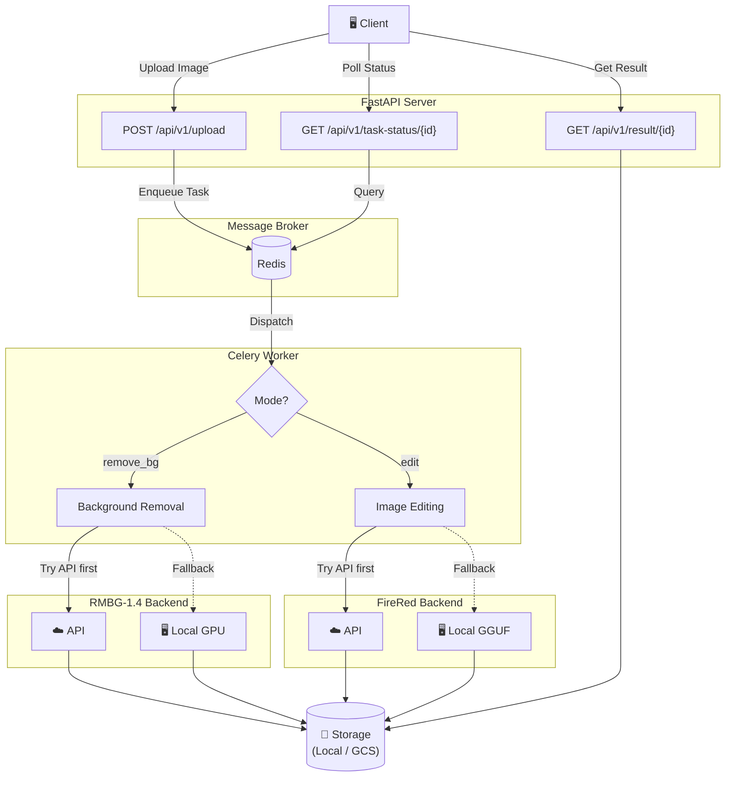

# AI E-Commerce Media Studio

AI-powered e-commerce media generation platform for images and videos.
Upload a product photo → get a professionally edited image or a cinematic product video in seconds.

## ✨ What It Does

### Background Removal

Automatically removes the background from a product image, producing a transparent PNG.

| Original | Result |
| :---: | :---: |
|  |  |

### Instruction-based Image Editing

Describe a scene in natural language and the AI places your product in it.

| Original | Result |
| :---: | :---: |
|  |  |

### Product Video Generation

| Original | Result |
| :---: | :---: |
|  | <video src="https://github.com/user-attachments/assets/7c54f02a-41e8-4775-bfb7-0b5da476af90" controls width="100%" /> |

Turn a single product photo into a multi-scene promotional video in two steps:

1. **Storyboard** — upload the photo and GPT-5.4-mini Vision generates a cinematic shot list (shot type, camera motion, duration, prompt per scene). Falls back to a built-in template if the API is unavailable.
2. **Generate** — submit the storyboard to kick off a Celery background job that calls Replicate `wan-video/wan-2.2-i2v-fast` for each scene sequentially, then concatenates the clips into a single MP4 with smooth crossfade transitions.

Transitions are handled at two levels: each clip is conditioned on the last frame of the previous clip (Wan `last_image`), and the final video is assembled with an FFmpeg `xfade` crossfade (0.5 s fade between each scene).

```bash
# Step 1 — generate storyboard
curl -X POST http://localhost:8000/api/v1/video/storyboard \
  -F "image=@product.jpg" \
  -F "style=cinematic" \
  -F "num_scenes=3"

# Step 2 — pass the Step 1 response directly (extra fields are accepted and ignored)
curl -X POST http://localhost:8000/api/v1/video/generate \
  -H "Content-Type: application/json" \
  -d '<paste Step 1 JSON response here>'

# Poll status
curl http://localhost:8000/api/v1/video/status/<task_id>
```

#### 🎬 Video Style Cookbook

The `style` field is passed to GPT-5.4-mini as creative direction. Recommended values:

| Style | Best For | Description |
|---|---|---|
| `cinematic` | All categories | Dramatic film-like shots, dynamic camera movements, rich depth of field |
| `minimal` | Tech / Gadgets / Beauty | Clean white background, extreme close-ups, product-only focus |
| `luxury` | Watches / Jewellery / Spirits | Dark backgrounds, rim lighting, slow reveals, premium aesthetic |
| `lifestyle` | Home / Fashion / Food | Product in real-world settings — desk, kitchen, outdoor |
| `dynamic` | Sports / Sneakers / Energy drinks | Fast-paced motion, energetic reveals, high-contrast lighting |
| `nature` | Skincare / Organic / Beverages | Natural materials, soft outdoor lighting, earthy tones |
| `editorial` | Fashion / Cosmetics | High-fashion magazine composition, artistic framing, bold colour |

---

## 🚀 Quick Start

### Prerequisites

- Python 3.12+
- Redis (for task queue)
- NVIDIA GPU with CUDA *(optional — only needed for local AI inference, see [Compute Modes](#-flexible-compute) below)*

### 1. Install & Run

```bash
# Install dependencies
uv sync

# Start the API server
uv run uvicorn app.main:app --reload

# Start the Celery worker (in a separate terminal)
# On Linux/macOS (Cloud/Production):
uv run celery -A app.core.celery_app worker --loglevel=info

# On Windows (Local Demo):
uv run celery -A app.core.celery_app worker --pool=solo --loglevel=info
```

### 2. Try It

**Remove background:**

```bash
curl -X POST http://localhost:8000/api/v1/upload \
  -F "file=@product.jpg" \
  -F "mode=remove_bg"
```

**Edit with an instruction:**

```bash
curl -X POST http://localhost:8000/api/v1/upload \
  -F "file=@product.jpg" \
  -F "mode=edit" \
  -F "instruction=Place this product on a sleek marble table with warm studio lighting, professional product photography"
```

### 3. Get the Result

```bash
# Poll task status
curl http://localhost:8000/api/v1/task-status/{task_id}

# Download result when completed
curl http://localhost:8000/api/v1/result/{task_id}
```

---

## 💡 Prompt Cookbook

Effective `instruction` examples for the `edit` mode:

| Category | Example Instruction |
|---|---|
| **Minimal & Clean** (Tech/Gadgets) | `Place this product on a clean white studio background with soft studio lighting, professional product photography, sharp focus, photorealistic` |
| **Dark & Premium** (Tech/Gadgets) | `Place this product on a sleek black marble podium with dark studio styling, dramatic rim lighting, premium aesthetic` |
| **Lifestyle** (Fashion/Home) | `Place this product on a cozy wooden table with a blurred bright cafe background in the morning, soft warm sunlight filtering through a window` |
| **Spa & Natural** (Beauty/Home) | `Place this product on a natural stone block surrounded by subtle green palm shadows, bright airy bathroom setting, spa atmosphere` |
| **Refreshing** (Cosmetics/Beverages) | `Place this product in crystal clear splashing water with bright summer lighting, turquoise background, high speed photography, refreshing vibe` |
| **Pop Art** (Cosmetics/Beverages) | `Surround this product with floating pastel geometric shapes, vibrant studio lighting, pop art style, clean colorful background` |
| **Street** (Sneakers/Footwear) | `Place this product on rough urban concrete with dramatic neon street lighting at night, puddle reflections, gritty and stylish footwear photography` |
| **Athletic** (Sneakers/Footwear) | `Suspend this product in mid-air against a sleek metallic studio surface, dynamic angle, high-energy directional lighting, premium athletic vibe` |

---

## 🏗️ Architecture



### 🔌 Flexible Compute

Both AI services follow an **API-first, local-fallback** strategy — configure via environment variables:

| Service | API Mode (Default) | Local Fallback |
|---|---|---|
| **Background Removal** | Replicate API / Custom Cloud API | RMBG-1.4 on local GPU |
| **Image Editing** | Replicate API / Custom Cloud API | FireRed-Image-Edit-1.1 GGUF on local GPU |

> **💡 Tip:** Use **API mode** for production. Use **local mode** for free development/debugging without API costs.

> **⚠️ Local GPU Note:** FireRed local inference requires **16GB+ VRAM** (RTX 4080/3090/4090). On 12GB cards (RTX 4070), expect severe memory swapping and 1-2 hour generation times. For these GPUs, use the API fallback.

### Key Features

- **Flexible Compute Architecture** — Zero-cost local GPU inference for development, cloud APIs for production.
- **Background Removal** — RMBG-1.4 with API-first, local GPU fallback.
- **Instruction-based Image Editing** — FireRed-Image-Edit-1.1 with API-first, local GGUF fallback.
- **Product Video Generation** — GPT-5.4-mini Vision storyboard + Replicate `wan-video/wan-2.2-i2v-fast` clips + FFmpeg xfade concat; sequential generation with 429 rate-limit retry; smooth transitions via Wan `last_image` conditioning + 0.5 s crossfade.
- **Async Processing** — Celery + Redis task queue isolates long-running AI tasks.
- **Storage** — Local filesystem with a modular interface for GCS migration.
- **Auth & Rate Limiting** — API Key, JWT, and configurable rate limiting (feature-flagged).

---

## 🔄 CI/CD

Every push to `main` and every pull request triggers a **3-stage GitHub Actions pipeline**:

```text
Lint & Type Check  →  Unit Tests  →  Docker Build
  (ruff, mypy)        (pytest)       (buildx, cached)
```


> **See:** [`.github/workflows/ci.yml`](.github/workflows/ci.yml)

### Deployment

Production deployment uses **Google Cloud Build** → **Cloud Run**:

```bash
# Deploy to Cloud Run (from local or CI)
gcloud builds submit --config deploy/cloudbuild.yaml \
  --substitutions=_REGION=asia-east1,_SERVICE_NAME=ai-ecommerce-media-studio

# Or apply the declarative service config directly
gcloud run services replace deploy/cloudrun-service.yaml --region=asia-east1
```

> **See:** [`deploy/cloudbuild.yaml`](deploy/cloudbuild.yaml) · [`deploy/cloudrun-service.yaml`](deploy/cloudrun-service.yaml)

---

## 📊 Monitoring & Observability

### Structured Logging

The application uses Python's `logging` module with structured output. In Cloud Run, logs are automatically ingested into **Cloud Logging** and correlated with request traces.

| Log Source | What It Captures |
|---|---|
| `app.main` | Application lifecycle, middleware events |
| `app.services.ai_service` | Model load times, inference parameters, API fallback events |
| `app.tasks` | Celery task start/complete/fail, processing duration |
| `app.core.auth` | Auth failures, rate limit hits |

### Health & Readiness

| Endpoint | Purpose | Used By |
|---|---|---|
| `GET /health` | Liveness check — returns `{"status": "healthy"}` | Cloud Run, Docker HEALTHCHECK, uptime monitors |

### Key Metrics to Monitor (Cloud Run)

| Metric | Why It Matters |
|---|---|
| **Request latency (p50/p95/p99)** | AI inference can spike — track tail latency |
| **Container instance count** | Auto-scaling behavior; correlate with traffic |
| **Memory utilization** | AI models are memory-heavy; detect OOM risk |
| **Celery queue depth** | If queue grows unbounded, workers can't keep up |
| **Error rate (5xx)** | API fallback failures, model load errors |

### Alerting Strategy

```text
🔴 Critical:  Error rate > 5% for 5 min  →  PagerDuty / Slack
🟡 Warning:   p95 latency > 30s          →  Slack
🟡 Warning:   Memory > 80%               →  Slack
🔵 Info:      Deployment completed        →  Slack
```

---

## 📖 Reference

### API Endpoints

| Method | Endpoint | Description |
|--------|----------|-------------|
| GET | `/health` | Health / liveness check |
| POST | `/api/v1/upload` | Upload image for background removal or editing |
| GET | `/api/v1/task-status/{id}` | Get image task status |
| GET | `/api/v1/result/{id}` | Get image processing result |
| POST | `/api/v1/video/storyboard` | Generate GPT-5.4-mini Vision storyboard from product image |
| POST | `/api/v1/video/generate` | Start async video generation from storyboard |
| GET | `/api/v1/video/status/{id}` | Poll video task status and per-clip progress |

### Project Structure

```text
app/
├── api/
│   ├── routes.py            # Image processing endpoints
│   └── video_routes.py      # Video generation endpoints
├── core/
│   ├── auth.py              # Authentication & Rate limiting
│   ├── config.py            # Settings (pydantic-settings)
│   └── celery_app.py        # Celery configuration
├── schemas/
│   ├── task.py              # Image task Pydantic models
│   └── video.py             # Video / storyboard Pydantic models
├── services/
│   ├── ai_service.py        # Background removal & image editing
│   ├── storyboard_service.py# GPT-5.4-mini Vision storyboard generation
│   ├── video_service.py     # Replicate clip generation & FFmpeg concat
│   └── storage.py           # Storage service (local / GCS)
└── tasks/
    ├── image_processing.py  # Celery task: image pipeline
    └── video_processing.py  # Celery task: video pipeline
tests/                       # pytest test suite
deploy/
├── cloudbuild.yaml          # Cloud Build pipeline (build → push → deploy)
└── cloudrun-service.yaml    # Cloud Run declarative service config (IaC)
.github/workflows/
└── ci.yml                   # GitHub Actions CI (lint → test → docker build)
```

### Configuration

Create a `.env` file (see `.env.example` for all options):

```env
# Storage
STORAGE_TYPE=local
LOCAL_STORAGE_PATH=./storage

# Redis
REDIS_URL=redis://localhost:6379/0

# AI APIs (optional — local model used as fallback if not configured)
# Replicate API (Recommended for production, handles both models)
REPLICATE_API_TOKEN=

# Custom API Endpoints (Fallback if Replicate applies differently)
RMBG_API_URL=
RMBG_API_KEY=
FIRERED_API_URL=
FIRERED_API_KEY=
# Path to local GGUF model file (used when API is unavailable)
FIRERED_MODEL_PATH=

# Video generation
OPENAI_API_KEY=                          # GPT-5.4-mini Vision storyboard generation
REPLICATE_VIDEO_MODEL=wan-video/wan-2.2-i2v-fast   # Replicate model for clip generation
```

### Development

```bash
# Run tests
uv run pytest -v

# Lint
uv run ruff check .

# Type check
uv run mypy .
```

## License

MIT
